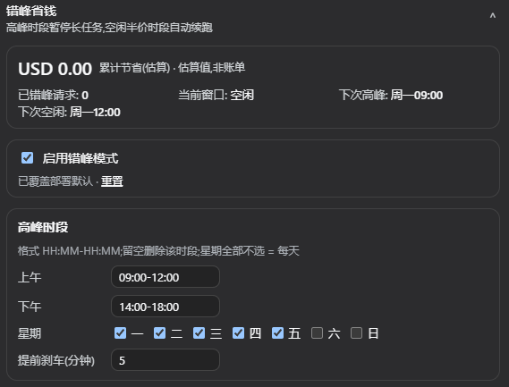

# dsh-peak-shift

把 dsh(DeepSeek Harness)里的长任务从「高峰计价时段」推迟到「空闲时段」执行,按 DeepSeek 的错峰计价规则(空闲价 = 高峰价 × 0.5)节省 token 费用。

内置的官方默认窗口:**北京时 周一至周五 09:00–12:00、14:00–18:00 为高峰;其余时间(含周末)为空闲**。

## 版本兼容

dsh 换过一次插件设置模型,本插件同时适配两代,安装同一份包即可:

| dsh 版本 | 宿主设置接口 | 浏览器设置接口 | 状态 |
|---|---|---|---|
| ≤ `0.1.1-rc.2` | `installSettingsSection`(`$DSH_HOME/settings.yaml`) | `settingsScope` + `settings.plugin.item` | ✅ 完整(含实时节省面板) |
| `0.1.2` – `0.1.6` | 无 | 无 | ⚠️ 闸门照常工作;设置页不可用,时段请写 `cordis.patch.yml` |
| ≥ `0.1.7-rc.2`(含 `0.2.x`) | `Config` 的 `.volatile()` 表单 + `settings` 服务 | `configForms` + `settings.plugins.tab` | ✅ 设置页可用(实时节省面板见下) |

两代在运行时自动探测(`lib/compat.js`),无需改配置。`0.2.0-rc.2` 起 dsh 会检查插件与自身的版本兼容性,本包的 `peerDependencies` 已声明 `^0.1.1-rc.2 || ^0.2.0-rc.2`。

| 能力 | ≤ 0.1.1-rc.2 | ≥ 0.1.7-rc.2 |
|---|---|---|
| 总开关 / 高峰时段 / 提前刹车 / 价格表 | ✅ | ✅ |
| 逐个任务「恢复」/「全部恢复」 | ✅ | 仅「全部恢复」 |
| 实时累计节省、活跃任务面板 | ✅ | ❌ 见 [已知限制](#已知限制) |

## 功能

- **总开关**:`enabled` 字段**热重载**关闭整个插件(无需重启);三种入口——web 设置页、`/peak-shift off` 聊天命令、`peak_shift_disable` 模型工具。关闭时会自动恢复被暂停的任务,绝不滞留。
- **Web 设置页**:插件自带浏览器端 bundle(`dsh.client`),在 dsh web / 桌面端的 **设置 → 插件** 中出现「错峰省钱」页面:切换错峰开关、编辑高峰时段(星期/上午/下午/提前刹车)、切换价格表、一键恢复任务。存储层随 dsh 版本自动选择(见 [版本兼容](#版本兼容))。
- **高峰自动暂停**:进入高峰窗口时,目标 agent 的下一个 LLM 请求被拦下(不发出),有 active goal 的任务还会持久化 `goals.pause` 停掉 round-driver。
- **空闲自动续跑**:到达空闲起点时恢复 goal(`goals.resume`)、把被拦的请求重新投回 inbox(`agent.steer`),继续执行。
- **不打断在途请求**:默认 `enforcement: 'gate'`,只拦「尚未发出的请求」;已在途的流式请求让它自然排空。可选的 `enforcement: 'cancel'` 才会中止在途 turn(会浪费已流式输出的 tokens,默认关闭)。
- **提前刹车**:`leadMinutes` 在高峰开始前提前启动闸门,保证高峰边界上没有在途请求。
- **费用估算**:按 **DeepSeek 官方价格表**(人民币/百万 tokens)把错峰后实际产生的 token 用量换算成「节省额」:内置 v4-flash(未命中 3.0 / 命中 0.10 / 输出 9.0 元)与 v4-pro(9.0 / 0.30 / 27.0 元)两档预设,设置页可切换,也可自定义价格表;空闲五折由 `offPeakFactor: 0.5` 表达(估算,非账单)。累计值通过 `/peak-shift status` 与 `peak_shift_stats` 工具读取。
- **任务面板**(仅 ≤ 0.1.1-rc.2 的实时面板):设置页里直接查看活跃 agent 列表——暂停/运行状态、手动暂停标记、暂存消息数、暂停原因、各任务累计节省;被暂停的任务可逐个或一键全部恢复。聚合统计从 sidecar 播种,**进程重启后依然连续**。更高版本见 [已知限制](#已知限制)。
- **手动控制**:`peak_shift_pause` / `peak_shift_resume` / `peak_shift_enable` / `peak_shift_disable` / `peak_shift_status` / `peak_shift_stats` agent 工具。

## 开关

四种方式都走同一个热重载主开关 `enabled`,即时生效、无需重启:

| 方式 | 用法 |
|---|---|
| 设置页 | 设置 → 插件 → 错峰省钱,勾选「启用错峰模式」 |
| 设置文件(≤ 0.1.1-rc.2) | 编辑 `$DSH_HOME/settings.yaml`:`peak-shift: { enabled: false }` |
| 设置文件(≥ 0.1.7-rc.2) | 编辑当前 profile 的 Cordis patch(`$DSH_HOME/profiles/<name>/cordis.yml`)中 `peak-shift` 行的 `config.enabled` |
| 聊天命令 | `/peak-shift on` / `/peak-shift off` / `/peak-shift status` |
| 模型工具 | `peak_shift_enable` / `peak_shift_disable` / `peak_shift_status`(含 `enabled` 字段) |

## Web UI

插件是双面的:Node 半(`lib/index.js`)跑闸门,浏览器半(`lib/client.js`)在 dsh web / 桌面端注册设置页。前端会自动扫描已启用插件里声明了 `dsh.client` 的包,无需额外配置。

存储与挂载位置随 dsh 版本变化(见 [版本兼容](#版本兼容)):

- **≤ 0.1.1-rc.2** — 卡片挂在 **设置 → 插件 → 可配置插件**,keyed 在 `peak-shift` 命名空间上;读写 `$DSH_HOME/settings.yaml`。
- **≥ 0.1.7-rc.2** — 页面挂在 **设置 → 插件** 的标签页,keyed 在 profile 条目 id(`peak-shift`);读写当前 profile 的 Cordis patch,表单来自 `Config` 的 `.volatile()` 字段。



设置页提供:

- **统计节省费用**(仅 ≤ 0.1.1-rc.2):累计节省估算(人民币金额)、已错峰请求数、当前窗口(高峰/空闲)、下次切换时刻,以及**价格表选择器**(v4-flash / v4-pro / 自定义)。数据是 Node 半随每次设置 `describe` 读取实时发布的快照(挂在命名空间 `base` 的 `stats` 块上),卡片挂载期间每 15 秒轮询刷新。聚合按 agent 播种自 sidecar 目录,进程重启后不归零。
- **开关错峰模式**:「启用错峰模式」复选框即时写入并生效,显示覆盖标记,可一键重置回部署默认。
- **设置开关时间**:高峰时段编辑——星期(周一至周日复选,全不选 = 每天)、上午/下午两个 `HH:MM-HH:MM` 时段(留空删除该时段,支持跨午夜如 `22:00-06:00`)、提前刹车分钟数。写入带 revision 乐观锁;**宿主在每次提交时热重建活窗口策略**,非法输入(错误格式/未知星期)会被宿主忽略并保留原策略,绝不会卡死闸门。
- **任务面板**(仅 ≤ 0.1.1-rc.2):活跃 agent 列表(状态 chip、手动暂停标记、暂存消息数、暂停原因、单任务节省)。恢复走 `commands` 命令通道:卡片写 `resume:<agentId>` 或 `resume-all`,宿主 watcher 执行一次后自动清空该字段;设置文档只读时命令不执行也不会重放。
- **一键全部恢复**(≥ 0.1.7-rc.2):逐个恢复需要活跃任务列表,该版本不可用,故只提供 `resume-all`。

关闭时会立即恢复所有自动暂停的任务(goal `resume` + 释放 parked 消息),不会滞留。


## 安装

插件是 dsh 的 **bundle**(`package.json` 声明 `dsh.bundle.patch`),安装后会:
1. 被 pnpm 装进 profile 的 `node_modules`;
2. 自动加入该 profile 的 `dsh.profile.bundles`;
3. 其 `cordis.patch.yml` 插入 `peak-shift` 插件行。

### 从 GitHub 安装(推荐)

```bash
dsh plugin --profile web add github:Pige-cutest/dsh-peak-shift-plugin#v0.4.0
```

> **从 ≤ 0.3.0 升级**:本版把配置骨架从「`settings.yaml` 命名空间」改为「Config + 两代自适应」。dsh 升级到 `0.1.7+` 时,旧 `$DSH_HOME/settings.yaml` 里的 `peak-shift` 段会被 dsh 一次性导入并重命名(见 [配置](#配置));`0.2.x` 上首次打开设置页会重建成新的表单值。升级前建议先备份 `$DSH_HOME`(至少 `settings.yaml`、`profiles/`、`peak-shift/`)。

web profile 是默认用法。想让 **headless** 批量任务也错峰,单独建一个 profile:

```bash
dsh plugin --profile headless add github:Pige-cutest/dsh-peak-shift-plugin#v0.4.0
```

安装后重启对应 profile(web / headless),可确认配置树:

```bash
dsh --profile web --dump-config | grep -A5 peak-shift
```

### 本地开发安装

从插件仓库克隆/源码目录执行:

```bash
dsh plugin --profile web add ./dsh-peak-shift
```

> **依赖解析**:插件的 peer 依赖(`@deepseek-ai/*`)不随插件安装,由 dsh 启动时维护的 `$DSH_HOME/profiles/node_modules` 扁平回退目录解析,无需额外步骤。
>
> **build 脚本**:本包没有 `prepare`/build 步骤,`lib/` 直接随仓库发布,pnpm 安装时无需放行 build scripts。

## 配置

默认全部开箱即用。按需在 profile 的 `cordis.patch.yml` 覆盖:

```yaml
- id: peak-shift
  config:
    enabled: true                # 总开关(默认 true);设置页/命令/工具可热重载覆盖
    targets: [goal]              # 哪些 agent 参与:goal | headless | subagent | interactive
    windows:
      zone: Asia/Shanghai        # IANA 时区
      peak:                      # 高峰段;days 空 = 每天
        - days: [mon, tue, wed, thu, fri]
          ranges: ['09:00-12:00', '14:00-18:00']
    leadMinutes: 5               # 高峰前提前启动闸门(分钟)
    enforcement: gate            # gate(默认,只拦新请求) | cancel(中止在途 turn)
    mode: park                   # park(持久化停车) | defer(进程内挂起) | off(仅记录)
    pricing:                     # 节省额估算用的价格模型(非账单)
      model: flash               # 官方价格表:flash | pro | custom(用 perMillion)
      currency: CNY              # 估算币种(官方表为人民币)
      perMillion: { input: 3.0, cacheRead: 0.1, cacheWrite: 0, output: 9.0 }  # model: custom 时生效
      peakFactor: 1.0            # 高峰价 = 单价 × peakFactor
      offPeakFactor: 0.5         # 官方规则:空闲 = 高峰的一半
    startPolicy: park            # 高峰中新建的长任务:park(等空闲) | run(按高峰价照跑)
    pollIntervalMs: 30000        # 窗口状态轮询周期
    stateDir: ''                 # park 状态文件目录,空 = $DSH_HOME/peak-shift
    settingsNamespace: ''        # (≥0.1.7)设置页绑定的 profile 条目 id,空 = 用加载器条目 id
```

> **可编辑字段**(≥ `0.1.7-rc.2`):`enabled`、`windows`、`leadMinutes`、`pricing`、`commands` 在 Config 里标记为 `.volatile()`,可由设置页实时改写;其余字段(如 `targets` / `mode` / `enforcement`)只能在 `cordis.patch.yml` 里改,改了需重启 profile。设置页的写入会落到当前 profile 的 Cordis patch,**不会**再写 `$DSH_HOME/settings.yaml`(旧文件会被 dsh 一次性导入并重命名为 `settings.yaml.imported`)。
>
> `commands` 是设置页与宿主之间的单向控制通道(写 `resume:<agentId>` 或 `resume-all`,宿主执行一次后自动清空),不是用户配置项。

### `mode` 说明

| 模式 | 行为 | 持久性 |
|---|---|---|
| `park`(默认) | 高峰请求被拦下(`agent/pre-step` 返回 reject),消息存进 sidecar;空闲时用 `agent.steer` 恢复 | **跨进程**:held 消息 + 累计统计持久化在 `$DSH_HOME/peak-shift/<sessionId>.json`(原子写入);goal 暂停/恢复本身由 `dsh-goal` 持久化 |
| `defer` | 高峰请求在 `agent/pre-step` 里挂起等待空闲,原批消息原样续跑 | 进程内;重启后由闸门自动重新拦下(自愈) |
| `off` | 不拦请求,只记录“本应错峰”的统计 | — |

## 工作原理

- **闸门**:在 `agent/pre-step`(waterfall)prepend 一个监听器。高峰 + 目标是长任务时,`defer` 模式不调用 `next()` 挂起等待,`park` 模式返回 `{ kind: 'reject' }` 收掉这一轮。请求从未发出 → 零 token 消耗。
- **长任务识别**:默认 `targets: [goal]` —— 只要 agent 有 goal(任意 phase)即视为长任务;`headless`/`subagent`/`interactive` 按需加入。
- **goal 暂停/恢复**:进入高峰时 `ctx.goals.pause(agent, ref)`(持久化 `active→paused`,round-driver 停止续轮,避免“followup→拦截→blocked”日志膨胀);空闲时 `ctx.goals.resume()` 重新 armed,round-driver 自动续下一轮。
- **状态与统计**:每个 agent 一个 runtime(`agent/created` 创建),窗口判定用 `Intl` 按时区计算星期几+分钟;节省额 = 错峰后实际 `assistant/message.usage` 的 token × 单价 × `(peakFactor − offPeakFactor)`。

## 模型工具

- `peak_shift_status` — 当前窗口、暂停态、下次切换、累计节省。
- `peak_shift_pause [reason]` / `peak_shift_resume` — 手动覆盖窗口。
- `peak_shift_stats` — 价格模型与累计明细。

## 测试

纯逻辑(windows / stats / compat)测试不依赖 `@deepseek-ai/*`。`smoke` 与 `client` 需要能解析 `@deepseek-ai/*` 依赖(smoke 会加载真实的 `installSettingsSection`)。在插件目录建立到本机 dsh 安装的 junction 后:

```bash
# 一次性(指向你本机 dsh 的真实依赖树)
cmd /c "mklink /J node_modules\\@deepseek-ai \"%APPDATA%\\npm\\node_modules\\@deepseek-ai\\dsh\\node_modules\\@deepseek-ai\""
npm test
```

## 已知限制

- **故障安全**:任何 peak-shift 内部错误只记告警,**绝不打断 agent 创建或 LLM 请求**。在工具服务不可用的组合(如 web 的 agent-preset 平面)会自动跳过 `peak_shift_*` 工具,pre-step 闸门照常工作。
- **≥ `0.1.7-rc.2` 的设置页没有实时运行时数据**:该代的设置表单由 `Config` schema 派生,`.volatile()` 解析出的是 cosmokit 的冻结引用(写入符号不对外),宿主无法把「累计节省 / 活跃任务列表」这类运行时状态发布进去;插件也没有可用的宿主→浏览器自定义通道(自定义 Remote 需要改动 BFF 装配)。因此该代的设置页只提供配置与控制,累计节省请用 `/peak-shift status` 或 `peak_shift_stats` 工具查看,**逐个任务恢复**降级为「全部恢复」。闸门、暂停/续跑、park 持久化、费用估算本身都不受影响。
- **`0.1.2` – `0.1.6` 无设置页**:这几代既没有 `installSettingsSection` 也没有 `SettingsForms`,闸门按 composition 配置正常工作,但设置 UI 不可用——时段请直接写 profile 的 `cordis.patch.yml`。
- **设置页的窗口编辑是扁平投影**:UI 只编辑第一组高峰条目(星期 + 上午/下午两个时段)和 `leadMinutes`;更复杂的窗口(多组高峰、多时段、其他时区)仍在 profile 的 `cordis.patch.yml` 里配置。设置页保存时整体替换第一组高峰条目的星期与时段。
- **远程浏览器无设置读写**:settings RPC 仅限 loopback;非本机浏览器上设置页不渲染(命名空间不可用),闸门不受影响。
- **统计数据按 agent 播种自 sidecar**(仅实时面板):聚合 = 各 agent 运行时实时值 + sidecar 目录里的历史累计;从未返回的旧会话也计入(这是「累计」语义)。恢复命令写入 `commands` 字段,由宿主消费后清空——多浏览器同时操作以最后写入者为准。
- **估算非账单**:节省额按配置价格表计算,DeepSeek 实际扣费以官方账单为准;价格表可按实际校准。
- **sidecar 非 session 日志**:park 的 held 消息存在独立文件,不参与 session 的 replay/导出;若 sidecar 丢失,闸门会在下一个高峰自动重新拦下(自愈)。
- **defer 挂起期间 agent 保持 `running`**:暂停的请求等待期间,该 agent 的 turn 不关闭(这是有意的)。
- **交互会话默认不参与**:只有 `targets` 命中(默认 goal)才错峰;普通对话不受影响。

## 与 dsh 官方包的关系

- 复用:`agent/pre-step`、`agent.steer/cancel`、`ctx.goals.pause/resume`、`ctx.sessions.flush`、`ctx.timer`、`dsh-tools` 工具注册、`dsh-atomic-write`、`dsh-home-paths`。
- 设置层按版本二选一:`dsh-settings` 的 `installSettingsSection`(≤ 0.1.1-rc.2)或 `settings` 服务 + `Config.volatile()`(≥ 0.1.7-rc.2)。`lib/compat.js` 负责探测并把两代的值合并成同一个可读视图;`@deepseek-ai/dsh-settings` 只做命名空间导入,避免在现代版本上因缺少具名导出而在 ESM 链接期直接失败。
- 浏览器端同样双路:`settingsScope` + `settings.plugin.item`(≤ 0.1.1-rc.2)或 `configForms` + `settings.plugins.tab`(≥ 0.1.7-rc.2),由 `apply()` 里的一次性探测挑选,`inject` 不声明任一版本专属服务(否则会在另一代永久 pending)。
- 不写入 session 日志自定义事件(仓库外插件的事件类型无法被持久化读取路径识别,会导致会话无法恢复),因此 park 状态走 sidecar 文件。

